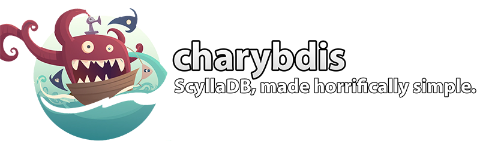

# charybdis 
[__/kəˈrɪbdɪs/__](https://en.wikipedia.org/wiki/Charybdis)

[](https://godoc.org/github.com/zeroflucs-given/charybdis)

[](https://opensource.org/licenses/MIT)




*"For on one side lay Scylla and on the other divine Charybdis terribly sucked down the salt water of the sea. Verily 
whenever she belched it forth, like a cauldron on a great fire she would seethe and bubble in utter turmoil, and high 
over head the spray would fall on the tops of both the cliffs."* -Homer

---

## Overview 
The `charybdis` package provides a range of features to simplify and enhance the developer experience when working with Scylla
in Go. It provides an opinionated, generics-enabled API that automatically performs table structure management and 
provides supporting functions for simple runtime access to data. If you want to just write structs and forget about managing
the keyspaces by hand, and use features like expiry, lightweight transactions together - `charybdis` might be what you're looking for.

Please note: **This package API should be considered unstable at this time. Once we stablize the API's, we'll mark it as v1**.

## Key Features
 - Simple queries by partition key, full key, indexes over tables with typed return objects.
 - Automatic management of database structure for simple (add column) scenarios.
 - Support for advanced features (conditional updates, TTL's)
 - Can configure using objects or by reflecting over structures.
 - Support for querying from materialized views (as well as auto-creation)

## About ZeroFlucs 
[ZeroFlucs](https://zeroflucs.io) is a B2B provider of pricing technology for Sportsbooks/wagering service providers globally. We
use Open-Source software through our platform stack. This, along with other projects is made available through our _zeroflucs-given_ 
Github profile on MIT licensing. To learn more you can visit:

- [The ZeroFlucs Website](https://zeroflucs.io) - For information about our products and services.
- [The ZeroFlucs Team Blog](https://blog.zeroflucs.io/) - For more content and posts from the ZeroFlucs team.
- [ZeroFlucs-Given](https://github.com/zeroflucs-given/) - For more OSS contributions.

## Why Does this Exist?
At ZeroFlucs we use ScyllaDB as the backbone of our Go based microservices platform. However, it was something of a 
love-hate relationship early on. We started with `gocql` and `gocqlx` packages (ScyllaDB forks), but the problems we 
encountered were a mix of general tooling availability, as well as trying to get features from the packages to work
cohesively. Our big pains were:

 - Lack of mature tooling to handle schema evolution, for basic additive scenarios (new tables, extra columns)
 - Large amounts of boilerplate for querying slices of objects, or common SELECT, INSERT, UPDATE scenarios.
 - Management of complex projections/alternate representations of data consistently.
 - Can't use features like LWTs, TTLs or other common scenarios in a fluid way with struct-based queries.

To address this, we created `charybdis` - a friend for Scylla. Charybdis is a Go package that provides a range of 
lightweight  low-code wrappers for interacting with ScyllaDB, as well as easy access to complex concepts such as LWTs,
indexes and some other features. In most use scenarios, this allows a developer to avoid writing 
DDL directly, and instead focus on writing application code. 

We love `gocql` and `gocqlx`, they're both under the hood still - however we just prefer to keep our services more
isolated from the nuts-and-bolts for common use cases.

---
## Usage
### Package Structure
There are the following sub-packages of `github.com/zeroflucs-given/charybdis`:

| Sub-Package | Role | 
|-------------|------|
| `generator` | Creates ScyllaDB compatible DDL statements from charybdis metadata objects. |
| `mapping`   | Reflects over structures to create metadata objects, for use with other areas of the package. |
| `metadata`  | Metadata objects and model structure detail. |
| `tables`    | A table-management helper for simplified working with tables in other programs. |

### Prerequisites
Our currently supported verisons are:

- ScyllaDB 4.5.x onward
- Golang 1.18 onward (as we use generics)

### Installing Package
To install:

```
go get -u github.com/zeroflucs-given/charybdis
```

### Concepts
The definitions of your ScyllaDB tables are represented in the `metadata` objects. You can either create these
through reflecting over a type (i.e. Struct to definition generation) or by hand-specifying a `TableSpecification`.

Once you've got a definition, you can use the `tables` package to create a `TableManager[T]` that will provide the
various helper methods for most commonly used operations.

If you want to have automatic schema management, the `generator` package contains code that will generate DDL
statements, as well as a `tables` integration that lets you automatically initialize the keyspace and table definitins.

---

## Example Usage

### Imports
```
import (
	"context"
	"fmt"
	"time"

	"github.com/gocql/gocql"
	"github.com/zeroflucs-given/charybdis/generator"
	"github.com/zeroflucs-given/charybdis/mapping"
	"github.com/zeroflucs-given/charybdis/tables"
	"go.uber.org/zap"
)
```

### Define Structure
Now we can define a struct that uses chardybris:

```
type Record struct {
	UserID    string `cql:"user_id" cqlpartitioning:"1"`         // User ID - Partition key
	FirstName string `cql:"first_name" cqlindex:"by_first_name"` // Name, indeexed
	Visits    int    `cql:"visits"`                              // Our value
}
```

### Create Table-Manager 
The code below combines lots of features together:

 - Provides a `TableManager[T]` that provides typed Get, Delete, Upsert, Update, Count, Scan operations.
 - Automatically creates the keyspace, if needed
 - Automatically creates the table and/or adds any missing columns
 - Creates any indexes referenced in the structure tags


You can alternatively omit the DDL management helpers, and specify a pre-built `metadata.TableSpecification` with `WithTableSpecification` option.

```
	hosts := []string{"127.0.0.1:9042"}

	ctx := context.TODO() // Replace with your app contexts
	cluster := gocql.NewCluster(hosts...)
	log, _ := zap.NewDevelopment()

	// Example Part 1 - Creating a table manager with automatic DDL management
	manager, err := tables.NewTableManager[Record](ctx,
		tables.WithCluster(cluster),                               		// Used to create connections
		tables.WithLogger(log),                                    		// Use a custom logger
		tables.WithKeyspace("examples"),                           		// The keyspace the table belongs to
		mapping.WithAutomaticTableSpecification[Record]("user_visits"), // Extract metadata from [Record] type
		generator.WithSimpleKeyspaceManagement(log, cluster, 1),   		// Simple keyspace with RF1 (create if needed)
		generator.WithAutomaticTableManagement(log, cluster),      		// Create the table if needed
	)
	if err != nil {
		panic(err)
	}
```

### Inserting Data
This record is inserted with a 1 minute TTL. For more information see the below r/e options that can be passed.

```
		errUpsert := manager.Insert(ctx, &Record{
			UserID:    fmt.Sprintf("test-user-%d", i),
			FirstName: fmt.Sprintf("User %d", i),
			Visits:    0,
		}, tables.WithTTL(time.Minute))
```

--- 

## Package: Tables
The most common usage of the package will be focused around `tables`, which uses Go 1.18+'s generics in order to
provide single-line operations for most CRUD scenarios, such as creating or selecting a record from a table.

### Insert
Inserts are semantically similar to updates/upserts, except with the enforcement of the `WithNotExists` option,
preventing data overwriting existing records with the same key. If data can be safely blindly overwritten, the
`Upsert` operation should be used.

#### Insert Option: WithTTL
The `tables.WithTTL(duration)` option sets the TTL for all cells written in this operation. This option can
be specified for inserts, updates or upserts.

### Update
Updates are upserts with the predicate enforced that a record must previously exist. This carries a small cost
penalty, however ensures that an update can only follow an insert.

#### Update Option: WithTTL
The `tables.WithTTL(duration)` option sets the TTL for all cells written in this operation. This option can
be specified for inserts, updates or upserts.

#### Update Option: WithSimpleIf
The `tables.WithSimpleIf(column, val)` option enforces that when updating a record, a specific column must have
a value that matches the expectation value. 

#### Update Option: WithConditionalUpdate
You can use `tables.WithConditionalUpdate(cmp, payload)` as an option input to pass a predicate that must be 
satisfied by the existing data in order for an operation to succeed. This allows for the construction of arbitrary
complex conditions.

### Upsert
Upserts are operations that can either insert or update data. They're essentially an `insert` that doesn't check
if the data already exists. This allows for fire-and-forget data writing, where you don't want to read existing
data first.  This generally should be used in scenarios where the consequences of writing data over the top of 
existing data has no material consequence and no secutity implications.

#### Upsert Option: WithTTL
The `tables.WithTTL(duration)` option sets the TTL for all cells written in this operation. This option can
be specified for inserts, updates or upserts.

### Views
The package supports views, with `ViewManager[T]` operating in a similar fashion to `TableManager[T]`. The
file `examples/views/main.go` shows using views with the framework.